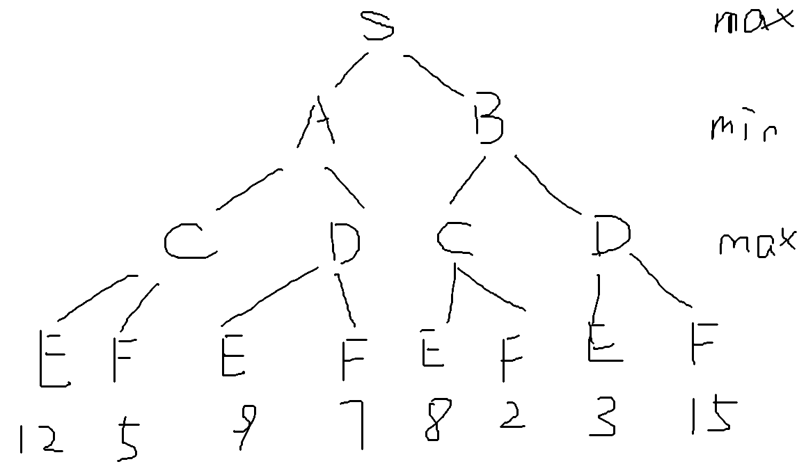
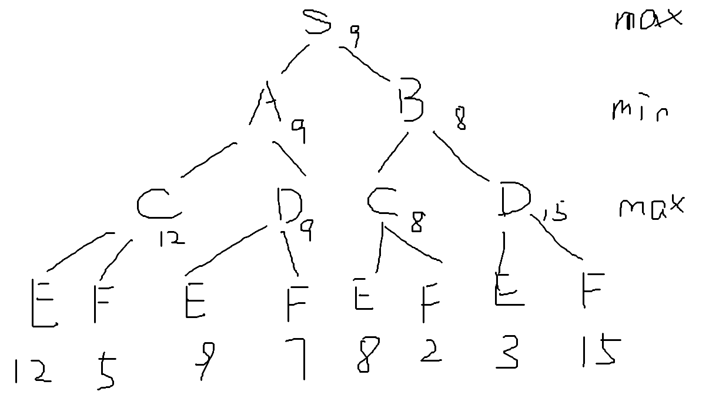
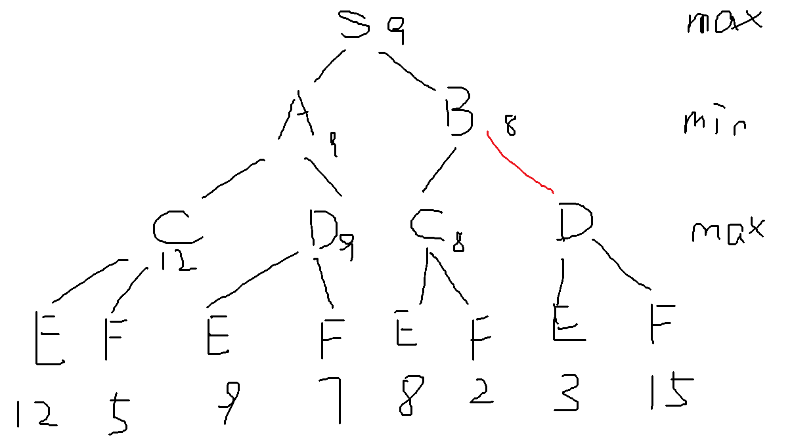
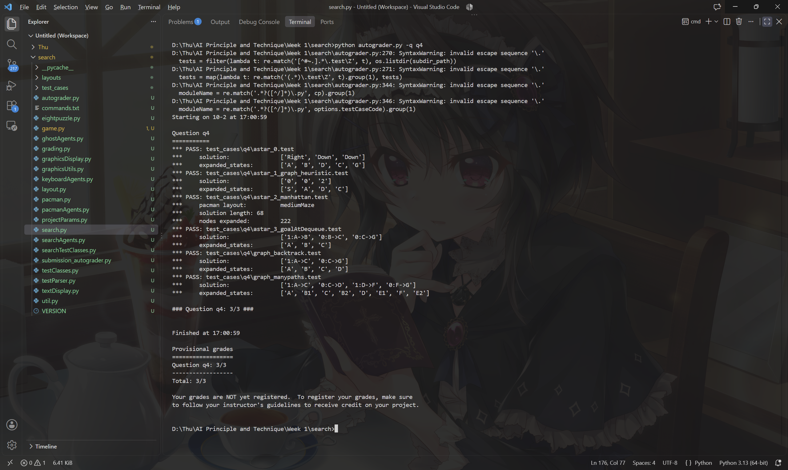
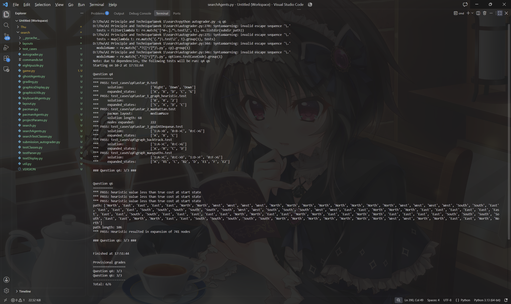
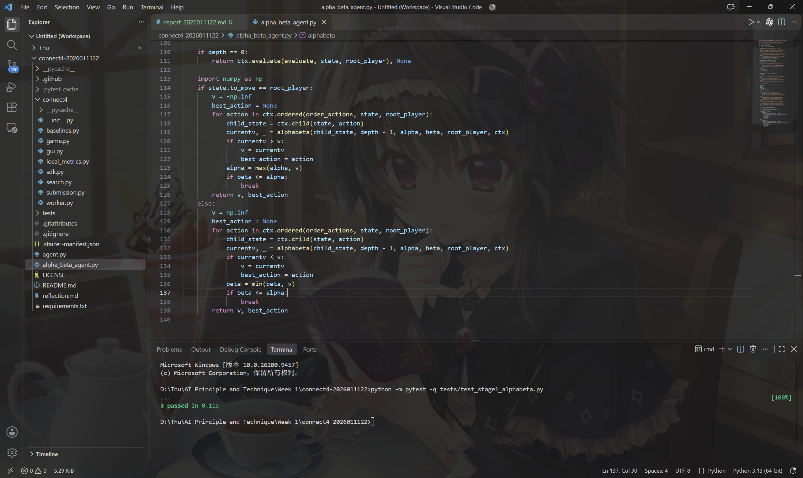
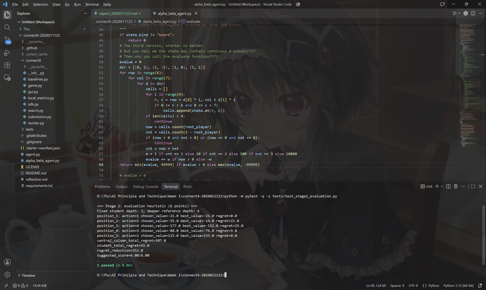
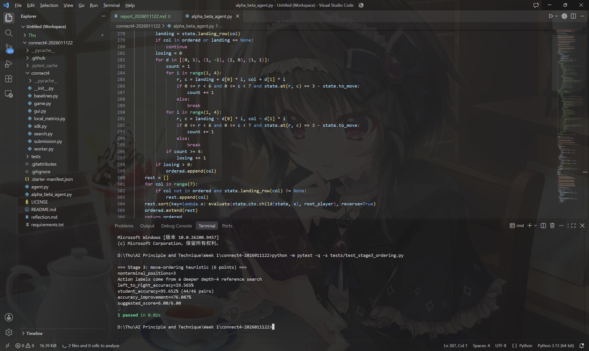

# 1. Writing Component

## 1.1 Search with Heuristics

a. #state = ${n^2 \choose n} \approx 2^{O(n \log n)}$.

b. We have $h_i(x_i, y_i)=\text{dis}((x_i, y_i), (n-i+1, n))$, so it is admissible. When there is other cars, it is not admissible since jump over a car can have a smaller cost.

c.

i. $\sum h_i$ is not admissible. Consider $(n-1)$-th car is at $(2, n-2)$ and $n$-th car is at $(2, n-1)$, other cars is arrived, then it costs 3 but the formular gets 4.

ii. $\min h_i$ is admissible. If there is only 1 car not arrived, then $\min h_i$ is actually the cost. If there is more than 2 car not arrived, then the cost is at least $\frac{1}{2}\sum h_i$, and $\min h_i \le \frac{1}{2}\sum h_i$.

iii. $\max h_i$ is not admissible. Consider $n-2$-th car is at $(3, n-1)$ and $n$-th car is at $(3, n-2)$, other cars is arrived, then it costs 3 but the formular gets 4.

iv. $n\min h_i$ is not admissible. The same counter example as i.

v. $n\max h_i$ is not admissible. The same counter example as iv.

## 1.2 Adjusted Heuristics

The example on the slide is enough. Consider $(S, A, 1)$, $(S, B, 1)$, $(A, C, 1)$, $(B, C, 2)$, $(C, G, 3)$ with $h_S=2$, $h_A=4$, $h_B=1$, $h_C=1$.

The first time we expand $C$ is by $S-B-C$ and is longer than $S-A-C$. Although we will increase $h_C$, but it's too late.

## 1.3 Adversarial Search

a. 

b. 

So the root is 9.

c. 

The red edge is pruned.

# 2. Programming Component 1: Search in Pacman

## 2.1 Introduction

## 2.2 Welcome to Pacman

## 2.3 Question 1: Finding a Fixed Food Dot using Depth First Search

## 2.4 Question 2: Breadth-First Search

## 2.5 Question 3: Varying the Cost Function

## 2.6 Question 4: A* search

## 2.7 Question 5: Finding All the Corners

## 2.8 Question 6: Corners Problem: Heuristic

# 3. Programming Component 2: Connect Four

## 3.1 Play a Few Games First

## 3.2 Question 1: Alpha-Beta Search

## 3.3 Question 2: Improve Evaluation

My evaluation is that for every potentially becoming connected-4 component (that is the continous 4-grids only contain one's piece and space), if there is 1 pieces, count 1 score; 2 pieces, count 20 score; 3 pieces, count 100 score; 4 pieces, count 10000 score.

This method can handle the difference between live 2 and dead 2 (a.k.a. 活二 和 冲二) and so on, so it is a reasonable evaluation.

## 3.4 Question 3: Improve Move Ordering

For a action that the player will win, or a action that the player must to take to avoid losing, they are at the beginning of the order. For the rest, I simply sort all actions with the evaluation function. Although to do this will lose nearly half of states count, it did well on scoring, getting 95% accuracy. And since the pairwise accuracy is high, it can prune a lot states, so the trade-off is worthy.
