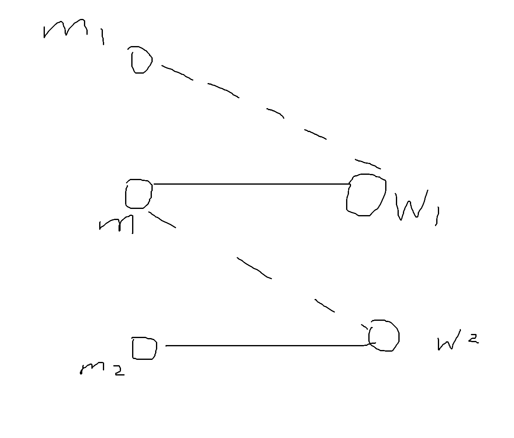
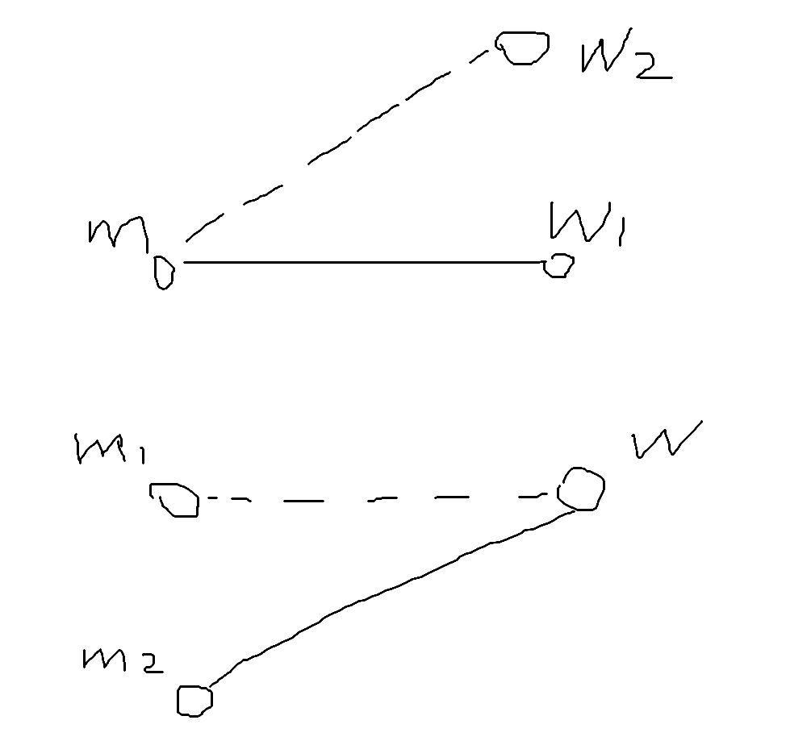

# Week1 Homework

By Deng Yufan without AI.

## Problem 5 (P108 T6)

We have a connected graph $G = (V, E)$, and a specific vertex $u \in V$. Suppose we compute a depth-first search tree rooted at $u$, and obtain a tree $T$ that includes all nodes of $G$. Suppose we then compute a breadth-first search tree rooted at $u$, and obtain the same tree $T$. Prove that $G = T$. (In other words, if $T$ is both a depth-first search tree and a breadth-first search tree rooted at $u$, then $G$ cannot contain any edges that do not belong to $T$.)

---

If $G$ is directed, then this statement is false since a 3-vertex ring breaks this statement. So we suppose $G$ is undirected.

We know that in DFS tree there is no crossing edge (i.e. 横叉边), and in BFS tree there is no backing edge (i.e. 返祖边). So since $T$ is both DFS tree and BFS tree, there is neither crossing edge nor backing edge in $T$, that is $T=G$.

## Problem 6

We are given $2n$ balls and $n$ bins. Each ball is thrown into a random bin (each bin is chosen with probability $1/n$). Compute the following limit
$$
\lim_{n→+\infty}\mathbb E[\frac{\text{the number of empty bins}}{n}].
$$

---

We have

$$
E[\frac{\text{the number of empty bins}}{n}]=\text{Pr}(i\text{-th bin is empty})=(\frac{n-1}{n})^{2n}.
$$

Then

$$
\lim_{n \rarr +\infty} (\frac{n-1}{n})^{2n} = \left[\lim_{n \rarr +\infty} (\frac{n-1}{n})^{n}\right]^2=\frac{1}{e^2}.
$$

## Problem 7

For two women $w$ and $w'$, we write $w <_m w'$ to denote that $w$ is worse than $w'$ in the preference list of man $m$. Given two stable matchings $f$ and $f'$ (You can easily construct an example in which there are multiple stable matchings), define a mapping $g = f \lor f'$ as follows:

- for each man $m$, assign him more preferred partner

$$
g(m) = f(m) \text{ if } f(m) \ge_m f'(m)
$$
$$
g(m) = f'(m) \text{ if } f'(m) >_m f(m)
$$

- for each woman $w$, assign her less preferred partner

$$
g(w) = f(w) \text{ if } f(w) \le_w f'(w)
$$
$$
g(w) = f'(w) \text{ if } f'(w) <_w f(w)
$$

Show that if both $f$ and $f'$ are stable matchings, so is $g$. (note: We can similarly define $f \land f'$. Then, all stable matchings form a distributive lattice, an abstractyet very popular object studied in combinatorics.)

---

We first prove $g$ is a matching. For a man $m$, let $w_1=f(m)$, $w_2=f'(m)$, $m_1=f'(w_1)$, $m_2=f(w_2)$, as the figure.

In stable matching $f$, we have $(m, w_2)$ is not a unstable match, that is $w_1 >_m w_2 \lor m <_{w_2} m_2$ holds. Similarly, since $(m, w_1)$ is not a unstable match in $f'$, we have $w_1 <_m w_2 \lor m <_{w_1} m_1$ holds.

Suppose $w_1 >_m w_2$, or say $g(m)=w_1$, then $w_1 <_m w_2 \lor m <_{w_1} m_1$ deduces $m <_{w_1} m_1$, that is $g(w_1)=m$. If $w_1 <_m w_2$, similarly, we can deduce that $g(m)=w_2$, $g(w_2)=m$.

Now we claim that for each man $m$, we have $g(g(m))=m$, thus $g$ is bijection, or say $g$ is a valid matching.

---

Suppose $(m, w)$ is a unstable match in $g$. Let $w_1=g(m)$, $m_1=g(w)$, so we have $w >_m w_1$ and $m >_w m_1$.

If $f(m)=w_1$ and $f(w)=m_1$, then $(m, w)$ is a unstable match in $f$, contradiction; if $f'(m)=w_1$ and $f'(w)=m_1$, then $(m, w)$ is a unstable match in $f'$, contradiction. So we have $f(m)=w_1 \ne f'(m)$ and $f'(w)=m_1 \ne f(w)$ (or $f'(m)=w_1 \ne f(m)$ and $f(w)=m_1 \ne f'(w)$, but is similar because $f$ and $f'$ can swap).

Let $w_2=f'(m)$, $m_2=f(w)$, as the figure.

Since $g(m)=f(m)=w_1$ and $g(m) \ne f'(m)=w_2$, we have $w_1 >_m w_2$.

Since $(m, w)$ is not a unstable match in $f'$, and $m >_w m_1$, we have $w_2 >_m w$.

And we already have $w >_m w_1$. That is $w_1 >_m w_2 >_m w >_m w_1$, contradiction. So $(m, w)$ is not a unstable match, thus $g$ is stable.
