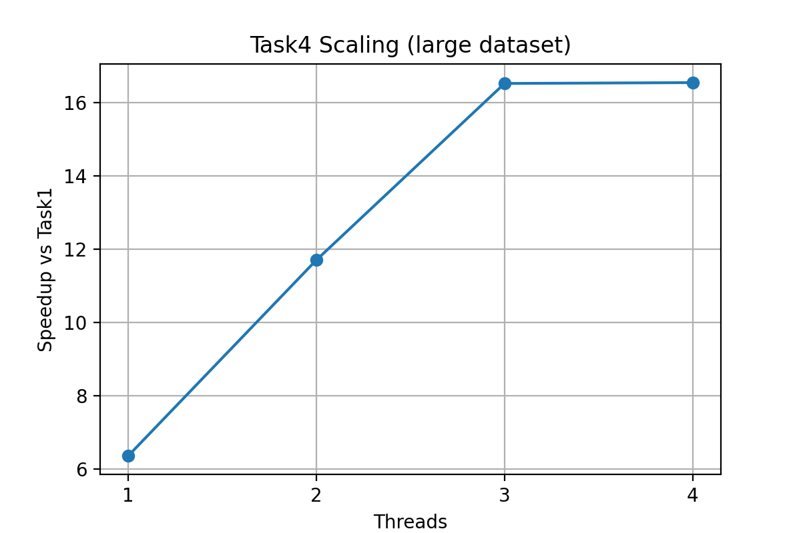

# Report

## 1. Design Description

Task 1: Just follow the definition of SDPA.

Task 2: Since the add, multiply, exponential is commutative, associative, distributive, we can only calculate a few ``scores`` once and update the final result online.

Task 3: The bottleneck of Task 2 is dot multiply, which can be optimized by SIMD. So we simply call the function defined in ``simd.c``, and complete the implement of dot multiply by SIMD in ``simd.c``.

Task 4: Since we paralleled the calculation of every rows, we can divide rows to multiple parts to let different cores to run. Further speaking, we divide the rows equally to every core, and the rows are continuous to enhance locality. After done a head, we synchronize all cores to avoid cores crowd out each other for the cache.

## 2. Performance Results

Name | Execution time (ms) | Speed up
:---: | :---: | :---:
task1 | 1917.327 | 1x
task2 | 1055.567 | 1.82x
task3 | 317.410 | 6.04x
task4 | 115.891 | 16.54x

## 3. Analysis

Task 2 perform similarly to Task 1: Since Task2 only changes the operation order, so it should have a similar time. Maybe the changed order enhanced the locality, and the compiler can easier to optimize, so Task 2 is a little bit faster then Task1.

NEON provides ~6x speedup: Since the SIMD merge 4 virables into a whole, and we used for-loop expand, so the speedup is reasonable.

1-3 threads speedup scale linearly, but 3 threads is similar to 4 threads: Before raise to 3 threads, since we make the multiple cores of CPU all running, the speedup is linearly increase. But when 4 threads, maybe the transmit speed rate between CPU and cache reached its limitation, so the speedup is limited by the speed rate and remains the same.

We have the speedup for 1 thread is 6.36x, 3 thread is 16.52x, so 4 thread should be 21.60x, but we only get 16.54x.
